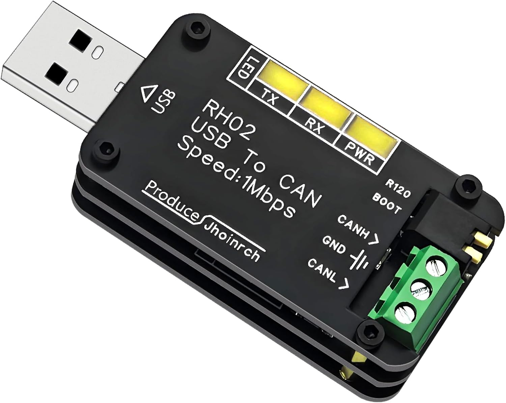

# wp_can_monitor: A simple Linux command line CAN bus tool for the Woodpecker
This is a simple bash script that allows you to view the data flowing on the Woodpecker's CAN bus.

  <!---TODO: add image of the script working![script working] (path/to/image.jpg)-->
  
## Tools required
- Linux bash terminal
- USB-to-CAN adapter


  The Woodpecker uses a [CANable adapter from Amazon]([url](https://a.co/d/0dVkjKnT)), but any device compatible with the SocketCAN Linux interface works.


## Use
Usage: ```$./wp_can_monitor <command> [options]```
 
Commands:

  -init                    Bring up can0 at baudrate of 500000 bps
  -deactivate              Reminder: run 'deactivate' in your shell when you're done
  
  -```init```                    Bring up can0 at baudrate of 500000 bps
  - ```decode steering```         Decode EPS1/EPS2 CAN messages
  - ```decode brake```            Decode DBS CAN messages
  - ```decode throttle```         Decode TCM CAN messages
  - ```decode all```              Decode all 12 V module CAN messages
  - ```log [raw.log] [out.log]``` Log bus traffic and decode all modules
  - ```filter <HEX:MASK>```       Filter messages by CAN ID (e.g. 201 for 0x201 = CommandThrottle)
 
Examples:
  - ```./wp_can_monitor init```
  - ```./wp_can_monitor decode steering```
  - ```./wp_can_monitor decode all```
  - ```./wp_can_monitor log```
  - ```./wp_can_monitor log my_raw.log my_decoded.log```
  - ```./wp_can_monitor filter 201```
 
