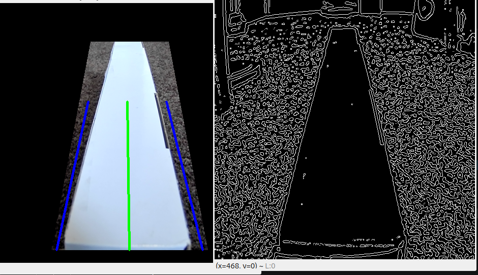

# line_following_v2: A line detection OpenCV-Python script

## Requirements
- Python ver. 3.8+
- pip (Python package manager)
- git (version control manager)

## Step one: clone this repository
Type into your terminal/shell:
```
git clone https://github.com/Substrate22/Woodpecker_Autonomy_v1.git
```

To setup, you need to install the following dependicies via:
```
cd Woodpecker_Autonomy
pip install numpy
pip install opencv-python
```

To run, type:
```
python3 line_following_v2.py
```

## Notes
- Video input: In the `process_frame` function, `cv.VideoCapture(0)` sets the laptop webcam as the video input source. To use a USB camera, you might need to try indexes 2, 3, or 4.
- The camera is meant to be placed at an angle close to the ground with the line at the same field of view as the trapezoidal frame. Try placing a rectangular object in front of a blank background and orienting the edges to match the trapezoid, as shown below: 

